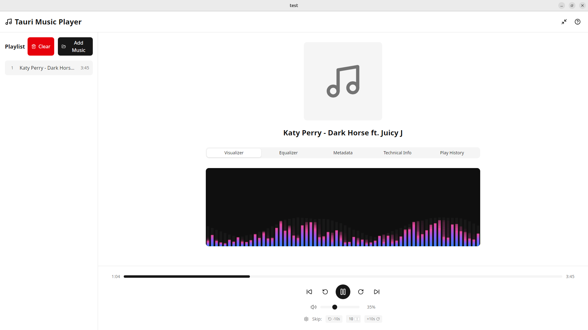

# 🎵 Tauri Music Player

Odtwarzacz muzyczny zbudowany w Tauri z React, TypeScript, Tailwind CSS i shadcn/ui.


## 📸 Screenshot


*Główny interfejs z visualizerem audio w akcji*

## ✨ Funkcje

- 🎶 **Obsługa wielu formatów audio**: MP3, WAV, FLAC, OGG, M4A
- ⏯️ **Kompletne kontrolki odtwarzania**: Play, Pause, Next, Previous, Stop
- 🔊 **Zaawansowana kontrola głośności**: Regulacja poziomu dźwięku z zapisywaniem ustawień
- 📋 **Inteligentne zarządzanie playlistą**: Automatyczne zapisywanie, czyszczenie, dodawanie wielu plików
- ⏱️ **Precyzyjne wyświetlanie czasu**: Aktualny czas i całkowity czas trwania z formatowaniem MM:SS
- 🎯 **Interaktywny seeking**: Klikanie i przeciąganie paska postępu do nawigacji w utworze
- ⏭️ **Inteligentne skipowanie**: Przyciski 10s oraz konfigurowalne skip (1-60s)
- 📊 **Zaawansowane metadane**: Wyświetlanie tytułu, artysty, albumu, roku, gatunku w dedykowanych tabs
- 🔧 **Informacje techniczne**: Codec, częstotliwość próbkowania, kanały, bits per sample
- 📈 **Historia odtwarzania**: Śledzenie odtworzonych utworów z licznikiem i datami
- ⌨️ **Kompletne skróty klawiszowe**: Sterowanie całym playerem klawiaturą
- 📊 **Visualizer audio**: Animowana wizualizacja spektrum dźwięku w czasie rzeczywistym
- 🎛️ **10-pasmowy Equalizer**: Precyzyjna kontrola częstotliwości z gotowymi presetami
- 🔲 **Mini-player mode**: Kompaktowy tryb z kontrolkami u dołu ekranu
- 🖼️ **Okładki albumów**: Automatyczne wyodrębnianie artwork z MP3/FLAC/innych formatów
- 🎨 **Nowoczesny UI z tabs**: Elegancki interfejs z shadcn/ui i organizacją w zakładki
- 💾 **Automatyczne zapisywanie**: Wszystkie ustawienia, playlist i historia w localStorage
- 🌙 **Dark mode ready**: Wsparcie dla ciemnego motywu
- 🔄 **Tryby odtwarzania**: Linear, Repeat All, Repeat One, Shuffle z automatycznym przełączaniem

## 📱 Interfejs użytkownika

### Główne sekcje aplikacji:
- **Playlist** (lewa strona): Lista utworów z metadanymi, przyciskami zarządzania
- **Now Playing** (środek): Okładka albumu z informacjami o utworze
- **Tabs**: 
  - *Visualizer* - Animowana wizualizacja spektrum audio w czasie rzeczywistym
  - *Equalizer* - 10-pasmowy equalizer (32Hz-16kHz) z presetami (Flat, Bass, Treble, Vocal, Rock, Electronic, Acoustic)
  - *Metadata* - Informacje o utworze (tytuł, artysta, album, rok, gatunek)
  - *Technical Info* - Parametry techniczne (codec, sample rate, kanały)
  - *Play History* - Historia odtworzeń z licznikami i datami
- **Controls** (dół): Pasek postępu, kontrolki odtwarzania, volume, custom skip

### Funkcje interaktywne:
- **Kliknij na utwór** w playlist aby go odtworzyć
- **Kliknij na pasek postępu** aby przeskoczyć do pozycji
- **Przeciągnij pasek postępu** aby płynnie przewijać
- **Dostosuj skip amount** (1-60s) i używaj przycisków +/- lub Shift+strzałki
- **Wszystkie ustawienia** są automatycznie zapisywane

## 🚀 Rozpoczęcie pracy

### Wymagania

- **Node.js** 18+ 
- **Rust** 1.70+
- **Linux**: `libasound2-dev`, `libwebkit2gtk-4.1-dev`, `libgtk-3-dev` oraz inne biblioteki GTK
- **macOS**: Brak dodatkowych wymagań
- **Windows**: WebView2

### Instalacja zależności systemowych (Ubuntu/Debian)

```bash
sudo apt update
sudo apt install libwebkit2gtk-4.1-dev \
    build-essential \
    curl \
    wget \
    file \
    libssl-dev \
    libgtk-3-dev \
    libayatana-appindicator3-dev \
    librsvg2-dev \
    libglib2.0-dev \
    libgdk-pixbuf-2.0-dev \
    libatk1.0-dev \
    libpango1.0-dev \
    libcairo2-dev \
    libasound2-dev
```

### Uruchomienie projektu

1. **Sklonuj repozytorium**
```bash
git clone <repository-url>
cd tauri-music-player
```

2. **Zainstaluj zależności Node.js**
```bash
npm install
```

3. **Uruchom w trybie deweloperskim**
```bash
npm run tauri dev
```

4. **Zbuduj wersję produkcyjną**
```bash
npm run tauri build
```

## 🏗️ Architektura

### Frontend (React + TypeScript)
- **React 18** z hooks dla zarządzania stanem
- **TypeScript** dla bezpieczeństwa typów
- **Tailwind CSS** dla stylizacji
- **shadcn/ui** dla komponentów UI
- **Lucide React** dla ikon

### Backend (Rust)
- **Tauri 2.0** dla integracji desktop z bezpieczeństwem i wydajnością
- **Rodio** dla wysokiej jakości odtwarzania audio z seeking
- **Symphonia** dla zaawansowanego dekodowania i ekstraktowania metadanych
- **Multi-threaded audio engine** z asynchroniczną komunikacją przez kanały
- **Persistent storage** z automatycznym zapisywaniem stanu aplikacji

### Struktura plików
```
├── src/                    # Frontend React
│   ├── App.tsx            # Główny komponent aplikacji
│   ├── main.tsx           # Entry point
│   ├── globals.css        # Style globalne
│   └── lib/
│       └── utils.ts       # Utility functions
├── src-tauri/             # Backend Rust
│   ├── src/
│   │   ├── lib.rs         # Główny moduł Tauri
│   │   └── audio.rs       # Moduł audio engine
│   ├── Cargo.toml         # Zależności Rust
│   └── capabilities/      # Uprawnienia Tauri
├── components.json        # Konfiguracja shadcn/ui
└── tailwind.config.js     # Konfiguracja Tailwind
```

## 🎯 Funkcjonalności

### ✅ Zaimplementowane
- [x] **Odtwarzanie audio**: Pełna obsługa MP3, WAV, FLAC, OGG, M4A
- [x] **Kontrolki odtwarzania**: Play, pause, stop, next, previous z pełną synchronizacją
- [x] **Zaawansowana kontrola głośności**: Regulacja z zapisywaniem i mute/unmute
- [x] **Seeking i nawigacja**: Klikalne i przeciągalne paski postępu z precyzyjnym seeking
- [x] **Inteligentne skipowanie**: Stałe 10s i konfigurowalne skip (1-60s) w obu kierunkach
- [x] **Kompletne zarządzanie playlistą**: Dodawanie, usuwanie, automatyczne zapisywanie
- [x] **Metadane i informacje techniczne**: Tabs z metadanymi utworów i parametrami audio
- [x] **Historia odtwarzania**: Śledzenie z licznikami odtworzeń i datami
- [x] **Skróty klawiszowe**: Pełne sterowanie klawiaturą z help overlay
- [x] **Persistence**: Automatyczne zapisywanie playlist, historii, głośności, ustawień
- [x] **Responsywny UI**: shadcn/ui tabs, eleganckie komponenty, dark mode ready
- [x] **Przeglądarka plików**: Multiple selection z automatycznym ładowaniem metadanych
- [x] **Visualizer**: Animowana wizualizacja spektrum audio w czasie rzeczywistym
- [x] **Equalizer**: 10-pasmowy equalizer z presetami i regulacją częstotliwości
- [x] **Mini-player mode**: Kompaktowy widok z kontrolkami na dole ekranu
- [x] **Obsługa okładek albumów**: Automatyczne wyodrębnianie i wyświetlanie artwork z plików
- [x] **Import biblioteki muzycznej**: Skanowanie folderów z progress tracking
- [x] **Eksport playlist**: Zapisywanie do plików M3U, PLS, JSON
- [x] **Tryby odtwarzania**: Repeat One, Repeat All, Shuffle, Linear z automatycznym przełączaniem utworów

### ⌨️ Skróty klawiszowe
- **Spacja** - Play/Pause
- **←/→** - Skip 10s backward/forward  
- **Shift + ←/→** - Skip custom amount backward/forward
- **↑/↓** - Volume up/down
- **M** - Mute/Unmute
- **Ctrl + P/N** - Previous/Next song
- **Ctrl + M** - Toggle mini player mode
- **Ctrl + H** - Show help
- **Esc** - Close help

## 🗺️ Roadmap - Plan rozwoju

### 🚧 Następne funkcje (Faza 1)
- [x] **Tryby odtwarzania**: Repeat (single/all), Shuffle, Linear
- [ ] **System oceniania**: 5-gwiazdkowy rating system dla utworów
- [ ] **Ulubione utwory**: Favoriting z szybkim dostępem
- [ ] **Filtrowanie biblioteki**: Wyszukiwanie i filtrowanie według artysty, gatunku, roku
- [ ] **Smart playlists**: Automatyczne playlisty na podstawie kryteriów
- [ ] **Global hotkeys**: Systemowe skróty działające poza aplikacją

### 🎯 Zaawansowane funkcje (Faza 2)
- [ ] **Crossfade**: Płynne przejścia między utworami
- [ ] **Gapless playback**: Odtwarzanie bez przerw między utworami
- [ ] **A-B repeat**: Powtarzanie wybranych fragmentów
- [ ] **Speed/pitch control**: Zmiana tempa i wysokości bez zmiany drugiego parametru
- [ ] **Audio effects**: Reverb, echo, compressor, stereo widener
- [ ] **Waveform display**: Wizualizacja fali dźwiękowej z możliwością nawigacji

### 🌐 Funkcje społecznościowe (Faza 3)
- [ ] **Last.fm integration**: Scrobbling i sync z profilem Last.fm
- [ ] **Discord Rich Presence**: Wyświetlanie aktualnego utworu na Discord
- [ ] **Spotify/YouTube Music sync**: Import playlist i metadata
- [ ] **Social sharing**: Udostępnianie utworów i playlist
- [ ] **Statistics export**: Raporty statystyk słuchania
- [ ] **Music discovery**: Rekomendacje na podstawie historii

### 🔧 Funkcje systemowe (Faza 4)
- [ ] **System tray integration**: Minimalizacja do zasobnika systemowego
- [ ] **Sleep timer**: Automatyczne wyłączenie po określonym czasie
- [ ] **Auto-pause**: Pauza przy zdarzeniach systemowych (rozmowy, inne audio)
- [ ] **Media keys support**: Obsługa klawiszy multimedialnych na klawiaturze
- [ ] **Background optimization**: Zoptymalizowane zużycie CPU/RAM w tle
- [ ] **Multi-language support**: Lokalizacja interfejsu (EN/PL/DE/FR)

### 📚 Zarządzanie biblioteką (Faza 5)
- [ ] **Tag editor**: Edycja metadanych (tytuł, artysta, album, rok, gatunek)
- [ ] **Auto-tagging**: Automatyczne tagowanie na podstawie baz danych online
- [ ] **Duplicate detection**: Wykrywanie i zarządzanie duplikatami
- [ ] **File organization**: Automatyczne organizowanie plików według wzorców
- [ ] **Album view**: Widok biblioteki według albumów z okładkami
- [ ] **Artist view**: Grupowanie według wykonawców z dyskografią

### 🎨 Personalizacja (Faza 6)
- [ ] **Multiple themes**: Różne motywy kolorystyczne (Dark, Light, Colorful)
- [ ] **Custom themes**: Kreator własnych motywów
- [ ] **Layout customization**: Konfigurowalne układy interfejsu
- [ ] **Visualizer themes**: Różne style wizualizacji audio
- [ ] **Custom equalizer presets**: Zapisywanie własnych ustawień equalizera
- [ ] **Widget system**: Konfigurowalne widgety w interfejsie

### 🔮 Funkcje przyszłościowe (Faza 7+)
- [ ] **Internet radio**: Obsługa stacji radiowych online
- [ ] **Podcast support**: Odtwarzanie i zarządzanie podcastami
- [ ] **Cloud sync**: Synchronizacja playlist i ustawień w chmurze
- [ ] **Mobile companion**: Aplikacja na telefon jako pilot
- [ ] **Plugin system**: API dla zewnętrznych rozszerzeń
- [ ] **AI features**: Automatyczne tworzenie playlist, mood detection
- [ ] **Lyrics display**: Wyświetlanie tekstów (LRC files + online sync)
- [ ] **Karaoke mode**: Tryb karaoke z usuwaniem wokali

## 📊 Priorytety rozwoju

**Wysoki priorytet:**
- Tryby odtwarzania (repeat/shuffle)
- System oceniania i ulubione
- Global hotkeys
- Filtrowanie i wyszukiwanie

**Średni priorytet:**
- Crossfade i gapless playback
- Audio effects
- Last.fm integration
- System tray

**Niski priorytet:**
- Cloud sync
- Mobile app
- AI features
- Plugin system

## 🛠️ Rozwój

### Dostępne skrypty

```bash
# Uruchomienie w trybie deweloperskim
npm run tauri dev

# Budowanie wersji produkcyjnej
npm run tauri build

# Linting kodu (jeśli skonfigurowane)
npm run lint

# Formatowanie kodu (jeśli skonfigurowane)
npm run format
```

### Dodawanie nowych funkcji

1. **Frontend**: Edytuj pliki w katalogu `src/`
2. **Backend**: Dodaj nowe komendy Tauri w `src-tauri/src/lib.rs`
3. **Audio**: Rozszerz funkcjonalność w `src-tauri/src/audio.rs`

## 📝 Licencja

Ten projekt jest na licencji MIT - zobacz plik [LICENSE](LICENSE) dla szczegółów.

## 🙏 Biblioteki

- [Tauri](https://tauri.app/) - Framework do aplikacji desktop
- [Rodio](https://github.com/RustAudio/rodio) - Biblioteka audio dla Rust
- [Symphonia](https://github.com/pdeljanov/Symphonia) - Dekoder audio dla Rust
- [shadcn/ui](https://ui.shadcn.com/) - Komponenty UI
- [Tailwind CSS](https://tailwindcss.com/) - Framework CSS
- [Lucide](https://lucide.dev/) - Ikony
